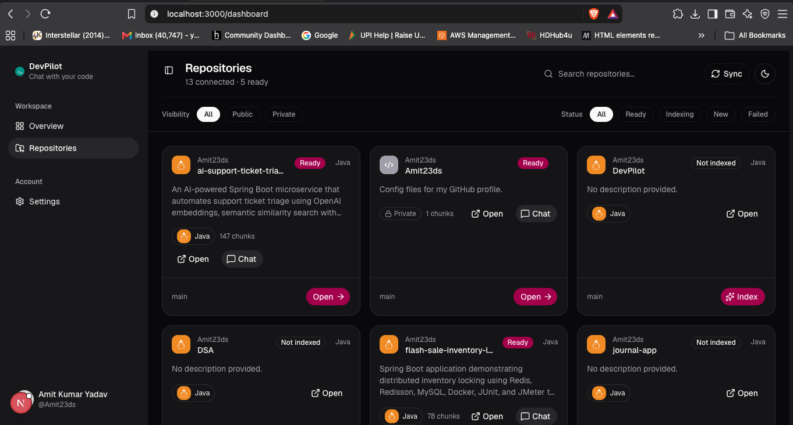
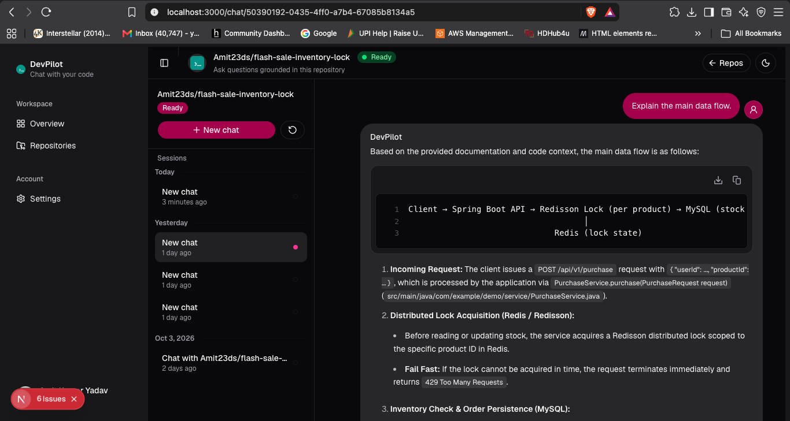
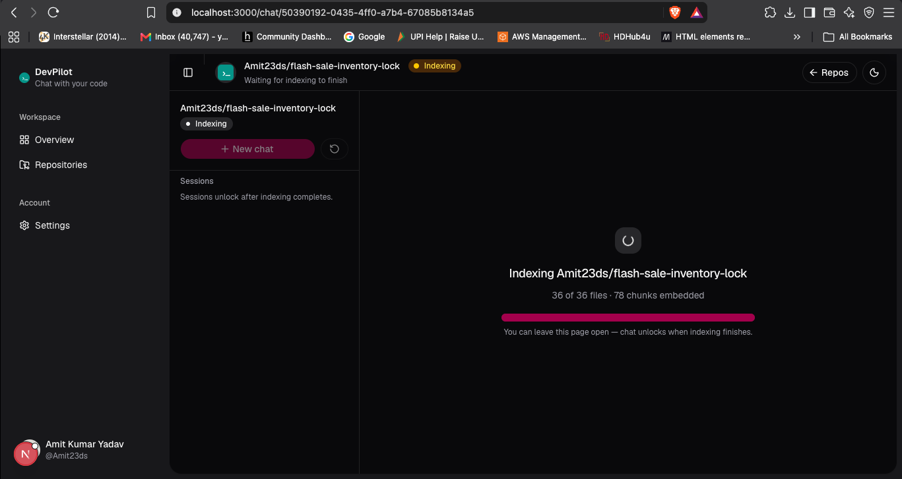
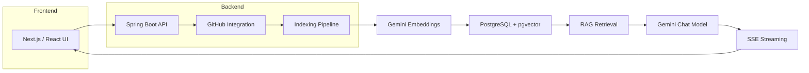

# DevPilot — GitHub RAG Code Assistant


DevPilot is a GitHub-backed RAG assistant for codebases. It connects to a
developer's GitHub account, indexes repository content, and lets developers
ask natural-language questions about source code using relevant retrieved
files and code chunks.

The project is designed to help developers understand unfamiliar repositories
faster by turning repository content into searchable embeddings and using a
Gemini-based chat model to answer questions with relevant code context.

---

## Project Highlights

- GitHub OAuth authentication and repository synchronization
- Asynchronous repository indexing and code chunking
- Gemini embeddings with PostgreSQL + pgvector
- Repository-scoped semantic retrieval
- HNSW vector indexing with cosine similarity
- SSE-based streaming AI responses
- Persisted chat sessions and message history
- Citation metadata for retrieved code context

### Current Indexing Scale

The current local development database contains:

| Metric | Value |
|---|---:|
| GitHub repositories indexed | **9** |
| Unique files indexed | **219** |
| Vectorized code chunks | **994** |
| Embedding dimensions | **768** |
| Vector index | **HNSW** |
| Similarity metric | **Cosine similarity** |

> These figures represent the current development database and are not fixed
> system limits.

---

## Features

- GitHub OAuth login and session-based authentication
- GitHub repository listing and synchronization
- Per-repository indexing workflow with status tracking
- Repository-level indexing progress and failure reporting
- Source file filtering and language detection
- Code chunking for repository content
- Gemini embeddings for code and document chunks
- PostgreSQL + pgvector vector storage
- Semantic similarity retrieval scoped to the selected repository
- RAG-based chat grounded in retrieved code context
- Streaming AI responses over Server-Sent Events (SSE)
- Chat session history and persisted message storage
- Citation metadata attached to generated responses

---

## Why DevPilot?

Large codebases are difficult to understand without prior context. Developers
often spend time searching through directories, reading files, and reconstructing
architecture from scattered source.

DevPilot addresses this by indexing repository content into a vector store and
retrieving relevant code passages for natural-language questions.

Instead of manually searching through a repository, developers can ask questions
such as:

- Where is authentication implemented?
- How does repository indexing work?
- What is the request flow for a particular feature?
- Where are database operations handled?
- How is a particular service connected to the rest of the application?

---

## How It Works

```mermaid
flowchart LR
    A[GitHub] --> B[GitHub OAuth]
    B --> C[Repository Sync]
    C --> D[Code Indexing]
    D --> E[Chunking]
    E --> F[Gemini Embeddings]
    F --> G[PostgreSQL + pgvector]
    G --> H[Semantic Retrieval]
    H --> I[Relevant Code Context]
    I --> J[Gemini Chat Model]
    J --> K[SSE Streaming]
    K --> L[Next.js UI]
```



The implemented flow is:

1. The user signs in with GitHub.
2. The backend synchronizes the user's accessible repositories from the
   GitHub API.
3. A selected repository is indexed asynchronously.
4. Repository files are filtered, downloaded, and split into chunks.
5. Each chunk is embedded using a Gemini embedding model.
6. The resulting vectors are stored in PostgreSQL using pgvector.
7. When the user asks a question, the backend embeds the prompt and performs
   similarity search inside the selected repository's vector space.
8. Relevant code chunks are assembled as context.
9. The Gemini chat model receives the retrieved context and repository information.
10. The response is streamed back to the frontend over SSE.
11. The frontend renders the streamed answer and citation information.

---

## Screenshots

### Repository Dashboard



*GitHub repositories connected to DevPilot with indexing status.*

### RAG Chat



*Natural-language codebase question answered using repository-scoped retrieval.*

### Repository Indexing



*Repository indexing and code processing workflow.*

## Architecture



---

## Tech Stack

| Layer | Technology |
|------|------------|
| Frontend | Next.js 16, React 19, TypeScript, Tailwind CSS |
| UI Components | shadcn-style component library, custom UI layer |
| Backend | Java 21, Spring Boot 4.1.1, Spring Web MVC |
| Security | Spring Security, GitHub OAuth 2.0 |
| Data Access | Spring Data JPA |
| AI | Google Gemini via Spring AI |
| Embeddings | Google GenAI embedding model |
| Database | PostgreSQL 16 |
| Vector Database | pgvector |
| Vector Index | HNSW |
| Similarity | Cosine similarity |
| Streaming | Server-Sent Events (SSE) |
| Build Tools | Maven, npm |
| Infrastructure | Docker Compose |
| Testing | Spring Boot smoke test |

---

## Project Structure

```text
DevPilot/
├── backend/
│   ├── src/
│   │   ├── main/
│   │   │   ├── java/devPilot/backend/
│   │   │   │   ├── config/
│   │   │   │   ├── controllers/
│   │   │   │   ├── entity/
│   │   │   │   ├── repository/
│   │   │   │   ├── security/
│   │   │   │   └── services/
│   │   │   └── resources/
│   │   │       └── application-example.properties
│   │   └── test/java/devPilot/backend/
│   ├── pom.xml
│   ├── mvnw
│   └── mvnw.cmd
│
├── client/
│   ├── app/
│   ├── components/
│   ├── hooks/
│   ├── lib/
│   ├── public/
│   ├── package.json
│   ├── next.config.ts
│   └── tsconfig.json
│
├── docker/
│   └── postgres/init-extensions.sql
│
├── docker-compose.yml
├── .gitignore
└── README.md
```

### Important Directories

- `backend/` contains the Spring Boot API, GitHub integration, indexing logic,
  vector retrieval, and AI orchestration.
- `client/` contains the Next.js application, repository dashboard, chat UI,
  and authentication flow.
- `docker/` contains PostgreSQL extension initialization scripts.
- `docker-compose.yml` provisions the PostgreSQL + pgvector database.

---

## RAG Pipeline

DevPilot uses a repository-scoped retrieval pipeline.

```text
GitHub Repository
       │
       ▼
Repository File Tree
       │
       ▼
File Filtering
       │
       ▼
Code Chunking
       │
       ▼
Gemini Embeddings
       │
       ▼
PostgreSQL + pgvector
       │
       ▼
User Question
       │
       ▼
Question Embedding
       │
       ▼
HNSW Similarity Search
       │
       ▼
Relevant Code Chunks
       │
       ▼
Gemini Chat Model
       │
       ▼
SSE Streaming
       │
       ▼
Next.js UI
```

The pipeline works as follows:

1. The user signs in with GitHub and selects a repository.
2. The backend fetches repository metadata and the file tree from GitHub.
3. Eligible source files are filtered and downloaded.
4. Files are split into manageable chunks using Spring AI's token-based
   text splitter.
5. Each chunk is converted into an embedding using the Gemini embedding model.
6. Embeddings are stored in PostgreSQL using pgvector.
7. A user question is embedded using the same embedding model.
8. The backend performs similarity search within the selected repository.
9. Relevant chunks are retrieved as context.
10. The retrieved context is provided to the Gemini chat model.
11. The generated response is streamed to the frontend over SSE.

This is a repository-scoped RAG flow: retrieval is limited to the selected
repository, and the retrieved code is provided to the chat model as context
for generating the response.

---

## Example Questions

DevPilot is designed to answer questions such as:

- "What is the architecture of this repository?"
- "Where is authentication implemented?"
- "Explain the request flow for creating a user."
- "Where is GitHub integration handled?"
- "Which files manage repository indexing and status updates?"
- "How is chat session state stored?"
- "Where are code chunks and vector metadata created?"
- "How does the indexing pipeline work?"
- "Where is the database configuration defined?"

---

## Getting Started

### Prerequisites

- Java 21
- Node.js 20+
- npm
- Docker
- Git
- A GitHub account with access to the repositories you want to index
- A Gemini API key

---

### Clone the Repository

```bash
git clone https://github.com/Amit23ds/DevPilot.git
cd DevPilot
```

---

## Configuration

The backend reads sensitive configuration from environment variables.

Set the required variables in your shell or development environment before
starting the backend.

**Do not commit real API keys, OAuth secrets, database credentials, or other
sensitive configuration to Git.**

Example:

```bash
export GEMINI_API_KEY=your_gemini_api_key

export GITHUB_CLIENT_ID=your_github_client_id
export GITHUB_CLIENT_SECRET=your_github_client_secret

export DB_URL=jdbc:postgresql://localhost:5433/devpilot
export DB_USERNAME=postgres
export DB_PASSWORD=postgres

export FRONTEND_URL=http://localhost:3000
export CORS_ALLOWED_ORIGINS=http://localhost:3000

export TOKEN_ENCRYPTOR_PASSWORD=change_me
export TOKEN_ENCRYPTOR_SALT=change_me
```

The repository includes:

```text
backend/src/main/resources/application-example.properties
```

as a reference configuration.

The real:

```text
backend/src/main/resources/application.properties
```

is kept local and excluded from version control.

---

## Database Setup

DevPilot uses PostgreSQL with the pgvector extension.

Start the database using Docker Compose:

```bash
docker compose up -d
```

The configured development database is:

| Setting | Value |
|---|---|
| Container | `devpilot-postgres` |
| Image | `pgvector/pgvector:pg16` |
| Database | `devpilot` |
| Username | `postgres` |
| Password | `postgres` |
| Host Port | `5433` |
| PostgreSQL Port | `5432` |

The database initialization script enables:

- `vector`
- `hstore`
- `uuid-ossp`

---

## Running the Backend

From the repository root:

```bash
cd backend
./mvnw spring-boot:run
```

The backend runs on:

```text
http://localhost:8080
```

The application connects to PostgreSQL on:

```text
localhost:5433
```

unless overridden by the local configuration.

---

## Running the Frontend

From the repository root:

```bash
cd client
npm install
npm run dev
```

The frontend runs on:

```text
http://localhost:3000
```

---

## Security

- Never commit API keys, OAuth secrets, or database credentials.
- Keep Gemini and GitHub OAuth secrets server-side.
- Do not expose secrets through frontend code or browser-accessible bundles.
- Use environment variables for sensitive local configuration.
- Keep the real `application.properties` file out of version control.
- Use `application-example.properties` as the safe configuration reference.
- Rotate credentials immediately if a secret is accidentally exposed.

---

## API / Backend Overview

The backend exposes the following main endpoints:

| Method | Endpoint | Purpose |
|--------|----------|---------|
| `GET` | `/api/auth/login-url` | Returns the GitHub OAuth redirect URL |
| `GET` | `/api/auth/me` | Returns the authenticated user profile |
| `GET` | `/oauth2/authorization/github` | Spring Security GitHub OAuth entry point |
| `GET` | `/api/repos` | Lists synchronized repositories for the authenticated user |
| `GET` | `/api/repos/{id}` | Returns repository details |
| `POST` | `/api/repos/{id}/index` | Starts repository indexing |
| `GET` | `/api/repos/{id}/status` | Returns current indexing status |
| `POST` | `/api/chat/sessions` | Creates a chat session for a repository |
| `GET` | `/api/chat/sessions` | Lists chat sessions for a repository |
| `GET` | `/api/chat/sessions/{id}` | Returns existing chat messages |
| `POST` | `/api/chat/sessions/{id}/messages` | Streams a model response for a user question using SSE |

---

## Challenges & Engineering Decisions

### GitHub Repository Ingestion

The application retrieves repository metadata and file trees from the GitHub API
and filters files before indexing.

### Code Chunking

Repository files are split into manageable chunks using
`TokenTextSplitter`. Chunk metadata includes information such as file path,
language, chunk index, and repository ID.

### Vector Storage

Embeddings are persisted in PostgreSQL through pgvector.

Retrieval is filtered by repository so that a question for one repository does
not retrieve chunks from another repository.

### Embedding Dimensionality

The project uses **768-dimensional embeddings**, matching the configured Gemini
embedding dimensions and the pgvector schema.

### Semantic Retrieval

The vector store uses an **HNSW index with cosine similarity** for semantic
nearest-neighbor retrieval.

### Streaming AI Responses

`SseEmitter` is used to stream model output back to the frontend without waiting
for the entire response to complete.

### Asynchronous Indexing

Repository indexing runs asynchronously so that the ingestion process does not
block the API request lifecycle.

### OAuth Integration

Spring Security handles GitHub OAuth authentication and maintains the
authenticated application session.

### GitHub API Pacing

A rate limiter is used during repository indexing to reduce pressure on the
GitHub API.

---

## Current Indexing Metrics

The current development database was inspected directly to measure the
repository indexing pipeline.

```text
Repositories indexed:     9
Unique files indexed:     219
Vector chunks stored:     994
Embedding dimensions:     768
Vector index:             HNSW
Similarity:               Cosine
```

These measurements demonstrate the current scale of indexed development data.
They are not hard-coded system limits.

---

## Future Improvements

The following are planned improvements rather than currently implemented
features:

- Hybrid keyword + vector search
- Reranking and improved retrieval scoring
- More code-aware chunking strategies
- Incremental indexing for changed repositories
- Stale vector cleanup and repository reindexing policies
- Better evaluation metrics for RAG answer quality
- Repository code explorer and file-level navigation
- Code generation and test creation helpers
- Usage- and dependency-aware code search
- Improved observability and monitoring of indexing and chat latency
- Automated evaluation datasets for retrieval and answer quality

---

## Testing

The project currently includes a minimal Spring Boot smoke test.

Run:

```bash
cd backend
./mvnw test
```

Current automated testing is limited to a Spring application context-loading
check in:

```text
backend/src/test/java/devPilot/backend/BackendApplicationTests.java
```

There is currently no dedicated frontend test suite configured.

---

## Deployment

DevPilot is currently intended as a local development and portfolio project.

There is no public hosted deployment at this time.

The application can be run locally using:

- Docker Compose for PostgreSQL + pgvector
- Spring Boot for the backend
- Next.js for the frontend

A production deployment can be added later with appropriate infrastructure,
secret management, OAuth callback configuration, database hosting, monitoring,
and API rate limiting.

---

## Author

**Amit Yadav**

GitHub:  
https://github.com/Amit23ds/DevPilot

---

## Summary

DevPilot converts a GitHub repository into a searchable code knowledge base by
filtering and chunking source files, generating Gemini embeddings, storing
vectors in PostgreSQL/pgvector, retrieving relevant code for each question, and
streaming a grounded response back to the developer.

The project combines GitHub OAuth, asynchronous indexing, vector search,
repository-scoped RAG, Gemini, PostgreSQL/pgvector, Spring Boot, and a Next.js
frontend into an end-to-end developer tool.