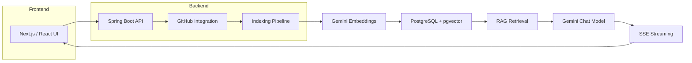

# DevPilot — GitHub RAG Code Assistant


DevPilot is a GitHub-backed RAG assistant for codebases. It connects to a developer's GitHub account, indexes repository content, and lets them ask natural-language questions about the source code to get answers grounded in relevant files and code chunks.

The project is designed to help developers understand unfamiliar repositories faster by turning repository content into searchable embeddings and using a Gemini-based chat model to answer questions with code context.

## Demo

No public demo URL or hosted deployment is configured in this repository.

The product workflow is:

GitHub Login
→ Select Repository
→ Index Repository
→ Ask Questions
→ Retrieve Relevant Code
→ Generate Answer

## Features

- GitHub OAuth login and session-based authentication
- GitHub repository listing and synchronization
- Per-repository indexing workflow with status tracking
- Repository-level indexing progress and failure reporting
- Source file filtering and language detection
- Code chunking for repository content
- Gemini embeddings for code/document chunks
- PostgreSQL + pgvector vector storage
- Semantic similarity retrieval scoped to the selected repository
- RAG-based chat grounded in retrieved code context
- Streaming AI responses over Server-Sent Events (SSE)
- Chat session history and persisted message storage
- Citation metadata attached to generated responses

## Why DevPilot?

Large codebases are difficult to understand without prior context. Developers often spend time searching through directories, reading files, and reconstructing architecture from scattered source. DevPilot addresses that by indexing repository content into a vector store and answering questions using the most relevant code passages instead of relying on broad repository-level guessing.

## How It Works

```mermaid
flowchart LR
    A[GitHub] --> B[GitHub OAuth]
    B --> C[Repository Sync]
    C --> D[Code Indexing]
    D --> E[Chunking]
    E --> F[Gemini Embeddings]
    F --> G[PostgreSQL + pgvector]
    G --> H[Semantic Retrieval]
    H --> I[Relevant Code Context]
    I --> J[Gemini Chat Model]
    J --> K[SSE Streaming]
    K --> L[Next.js UI]
```



The implemented flow is:

1. The user signs in with GitHub.
2. The backend synchronizes the user's accessible repositories from the GitHub API.
3. A selected repository is indexed asynchronously.
4. Repository files are filtered, downloaded, and split into chunks.
5. Each chunk is embedded with a Gemini embedding model.
6. The resulting vectors are stored in PostgreSQL using the pgvector extension.
7. When the user asks a question, the backend embeds the prompt and performs a similarity search inside the repository's vector index.
8. The relevant code chunks are assembled as context.
9. The Gemini chat model answers using that context and the repository name.
10. The response is streamed back to the frontend over SSE.
11. The frontend renders the streamed answer and any citations.

## Architecture



## Tech Stack

| Layer | Technology |
|------|------------|
| Frontend | Next.js 16, React 19, TypeScript, Tailwind CSS |
| UI Components | shadcn-style component library, custom UI layer |
| Backend | Java 21, Spring Boot 4.1.1, Spring Web MVC |
| Security | Spring Security, GitHub OAuth 2.0 |
| Data Access | Spring Data JPA |
| AI | Google Gemini via Spring AI |
| Embeddings | Google GenAI embedding model |
| Database | PostgreSQL |
| Vector Database | pgvector |
| Streaming | Server-Sent Events (SSE) |
| Build Tools | Maven, npm |
| Infrastructure | Docker Compose, pgvector container |
| Testing | Spring Boot testing smoke test |

## Project Structure

```text
DevPilot/
├── backend/
│   ├── src/
│   │   ├── main/
│   │   │   ├── java/devPilot/backend/
│   │   │   │   ├── config/
│   │   │   │   ├── controllers/
│   │   │   │   ├── entity/
│   │   │   │   ├── repository/
│   │   │   │   ├── security/
│   │   │   │   └── services/
│   │   │   └── resources/application.properties
│   │   └── test/java/devPilot/backend/
│   ├── pom.xml
│   ├── mvnw
│   └── mvnw.cmd
│
├── client/
│   ├── app/
│   ├── components/
│   ├── hooks/
│   ├── lib/
│   ├── public/
│   ├── package.json
│   ├── next.config.ts
│   └── tsconfig.json
│
├── docker/
│   └── postgres/init-extensions.sql
├── docker-compose.yml
├── .gitignore
├── README.md
└── .vscode/
```

Important directories:

- `backend/` contains the Spring Boot API, GitHub integration, indexing logic, vector retrieval, and AI orchestration.
- `client/` contains the Next.js application, repository dashboard, chat UI, and authentication flow.
- `docker/` contains the database initialization scripts for PostgreSQL extensions.
- `docker-compose.yml` provisions the PostgreSQL + pgvector database used by the backend.

## RAG Pipeline

DevPilot uses a straightforward repository-scoped retrieval pipeline:

1. The user signs in with GitHub and selects a repository from the synchronized list.
2. The backend fetches the repository metadata and file tree from the GitHub API.
3. Eligible source files are filtered and downloaded from GitHub.
4. Files are split into chunks using Spring AI's token-based text splitter.
5. Each chunk is converted into an embedding using the Gemini embedding model.
6. The embeddings are stored in PostgreSQL using the pgvector extension.
7. A user question is embedded using the same model family.
8. The backend searches for the nearest code chunks in the repository vector space.
9. The relevant chunks are passed to the Gemini chat model as context.
10. The model generates an answer grounded in the retrieved code.
11. The answer is streamed to the frontend over SSE, preserving a chat-like UX.

This is a repository-scoped RAG flow: retrieval is limited to the selected repository, and the chat model is constrained to use the retrieved code context.

## Example Questions

These are representative examples of the kinds of repository questions DevPilot is designed to answer:

- "What is the architecture of this repository?"
- "Where is authentication implemented?"
- "Explain the request flow for creating a user."
- "Where is GitHub integration handled?"
- "Which files manage repository indexing and status updates?"
- "How is chat session state stored?"
- "Where are code chunks and vector metadata created?"

## Getting Started

### Prerequisites

- Java 21
- Node.js 20+
- npm
- Docker
- Git
- A GitHub account with access to the repositories you want to index
- A Gemini API key

### Clone

```bash
git clone https://github.com/Amit23ds/DevPilot.git
cd DevPilot
```

### Environment Variables

This project reads configuration from environment variables for the backend. Create a local `.env` or export the values in your shell before running the app. Do not commit secrets or real credentials to source control.

Example:

```bash
export GEMINI_API_KEY=your_gemini_api_key
export GITHUB_CLIENT_ID=your_github_client_id
export GITHUB_CLIENT_SECRET=your_github_client_secret
export DB_URL=jdbc:postgresql://localhost:5433/devpilot
export DB_USERNAME=postgres
export DB_PASSWORD=postgres
export FRONTEND_URL=http://localhost:3000
export CORS_ALLOWED_ORIGINS=http://localhost:3000
export TOKEN_ENCRYPTOR_PASSWORD=change_me
export TOKEN_ENCRYPTOR_SALT=change_me
```

This repository does not currently include a `.env.example` file.

## Database Setup

The project includes a PostgreSQL + pgvector setup through Docker Compose.

Start the database:

```bash
docker compose up -d
```

The configured database service is:

- Container: `devpilot-postgres`
- Image: `pgvector/pgvector:pg16`
- Database: `devpilot`
- Username: `postgres`
- Password: `postgres`
- Port mapping: `5433:5432`

The init script in `docker/postgres/init-extensions.sql` enables:

- `vector`
- `hstore`
- `uuid-ossp`

## Running the Backend

From the repository root:

```bash
cd backend
./mvnw spring-boot:run
```

The backend defaults to the Spring Boot API port `8080` and connects to PostgreSQL on `localhost:5433` unless overridden by environment variables.

## Running the Frontend

From the repository root:

```bash
cd client
npm install
npm run dev
```

The frontend runs locally on:

```text
http://localhost:3000
```

## Environment & Security

- Never commit API keys, OAuth secrets, or database credentials.
- Keep Gemini and GitHub OAuth secrets server-side.
- Do not put secrets in frontend code or browser-accessible bundles.
- Use environment variables for local configuration.
- Keep sensitive values out of version control.
- Use a local `.env` file only for development and add it to `.gitignore` if you are managing secrets locally.

## API / Backend Overview

The backend exposes the following main endpoints.

| Method | Endpoint | Purpose |
|--------|----------|---------|
| `GET` | `/api/auth/login-url` | Returns the GitHub OAuth redirect URL |
| `GET` | `/api/auth/me` | Returns the authenticated user profile |
| `GET` | `/oauth2/authorization/github` | Spring Security GitHub OAuth entry point |
| `GET` | `/api/repos` | Lists synchronized repositories for the authenticated user |
| `GET` | `/api/repos/{id}` | Returns repository details |
| `POST` | `/api/repos/{id}/index` | Starts repository indexing |
| `GET` | `/api/repos/{id}/status` | Returns current indexing status |
| `POST` | `/api/chat/sessions` | Creates a chat session for a repository |
| `GET` | `/api/chat/sessions` | Lists chat sessions for a repository |
| `GET` | `/api/chat/sessions/{id}` | Returns existing chat messages |
| `POST` | `/api/chat/sessions/{id}/messages` | Streams a model response for a user question using SSE |

## Challenges / Engineering Decisions

A few engineering problems were directly addressed in the implementation:

- GitHub repository ingestion: the app pulls repo metadata and file trees from the GitHub API and filters out large or irrelevant files before indexing.
- Code chunking: the project uses `TokenTextSplitter` to convert repository files into manageable chunks with metadata such as file path and language.
- Vector storage: embeddings are persisted in PostgreSQL via pgvector, with repository-specific filtering to keep retrieval scoped to the selected repo.
- Embedding dimensionality: the configuration uses a 768-dimensional embedding size, matching the Gemini embedding settings used by the project.
- Semantic retrieval: the backend uses similarity search against the vector store to retrieve the most relevant code context for a natural-language query.
- Streaming AI responses: `SseEmitter` is used to stream tokens from the model back to the frontend without waiting for the entire answer to complete.
- Async indexing: indexing runs in an async executor so repository ingestion does not block the API request lifecycle.
- OAuth integration: Spring Security handles GitHub OAuth and maintains the app session for authenticated users.
- GitHub API pacing: a simple rate limiter is used to reduce pressure on the GitHub API during repository indexing.

## Future Improvements

These are realistic next steps rather than current features:

- hybrid keyword + vector search
- reranking and better retrieval scoring
- more code-aware chunking strategies
- incremental indexing for changed repositories
- stale vector cleanup and repository reindexing policies
- better evaluation metrics for RAG answer quality
- repository code explorer and file-level navigation
- code generation and test creation helpers
- usage- and dependency-aware code search
- improved observability and monitoring of indexing and chat latency

## Testing

The project includes a minimal Spring Boot smoke test:

```bash
cd backend
./mvnw test
```

Current coverage is limited to a context-loading check in `backend/src/test/java/devPilot/backend/BackendApplicationTests.java`. There is no dedicated frontend test suite configured in the project at present.

## Screenshots

There are no application screenshots or demo images checked into this repository at the moment. The project currently contains UI assets and icons under `client/public`, but not product screenshots.

## Author

Amit Yadav

GitHub: https://github.com/Amit23ds

## Summary

This README documents the implemented architecture and workflows of DevPilot, including GitHub OAuth, repository indexing, Gemini embeddings, pgvector retrieval, and SSE-based chat responses. It also includes verified local setup instructions and honest documentation of the current testing and deployment state.
